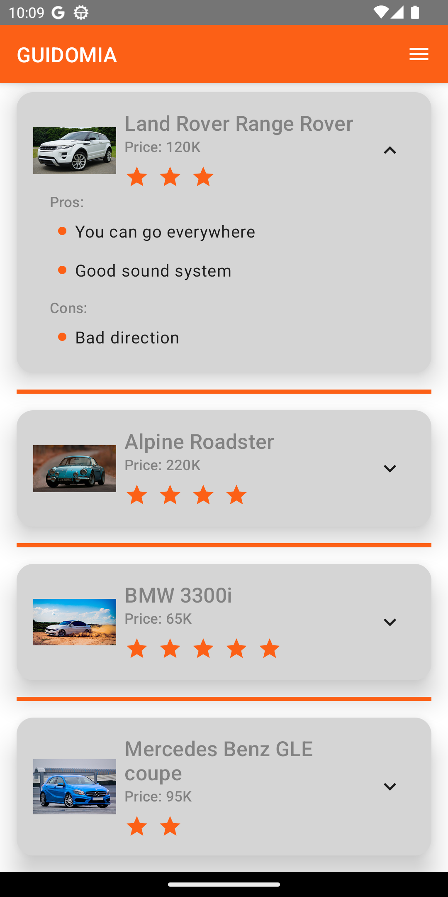
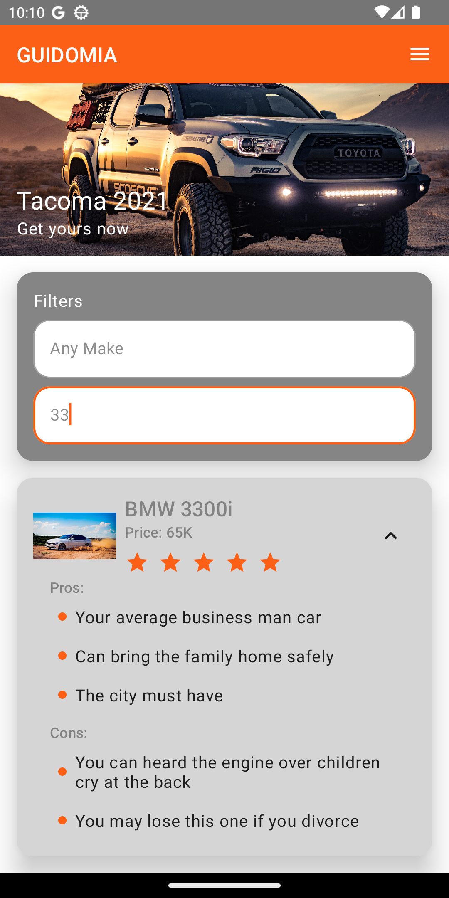

# Guidomia

A project for Technical Exam.

## Installation

Please make sure that you are using Android Studio Flamingo because it requires Java 17 for it to work. I cannot downgrade my Android Studio version.

## Tech Stack

- UI - Jetpack Compose with Material Design
- Serialization - KotlinX Serialization to easily convert JSON to Data class or vice-versa
- Storage - Room Database because it is powerful and you will write less boilerplate code and do more. It provides compile-time checks for SQL Query you write.

## Screenshots

  
  

## Architecture - MVVM w/ Clean Architecture

I have a few good reasons why I use MVVM w/ Clean Architecture:
- Separation of Concerns - We can see the package data, domain, and presentation. By doing that we know where to look more easily when the problem arises.
- Testability and Readability - You can easily unit test the application and it is easier to read for me.

